# Study Buddies 
Welcome to the Study Buddies Project. 

Study Buddies is a website dedicated to sharing study and exam tips to all who need it. Exam season can be stressful and knowing where to begin studying can be intimidating, therefore this site lets people (who've been through it all) to share any tips and tricks they want to. A source of inspiration for this site was Wikipedia. On Wikipedia people can share anything they'd like (as long as it follows the rules) regarding any topic. Whilst Wikipedia encompasses all topics related to absolutely anything in the world, Study Buddies focus on specifically studying, whether it's studying just for revision or studying for the all dreaded exam. Similar to Wikipedia, logged in users can share their own posts which ensures we have the latest tips and tricks and we can be sure they work! Even more importantly, it's crucial to be aware that everybody has different ways of working and studying. Because Study Buddies consists of posts written by users, we can be sure there is a plethora of information suitable for every need. 

You can view the deployed site [here](https://studybuddies-pp4-87eb5b7c6767.herokuapp.com/)

# Contents
* [**Project**](<#project>)
    * [Users Goal](<#users-goal>)
    * [Owners Goal](<#owners-goal>)
    * [Agile](<#agile>)
* [**User Experience**](<#user-experience>)
    * [Wireframes](<#wireframes>)
    * [User Stories](<#user-stories>)
* [**Features**](<#features>)
    * [Header](<#header>)
    * [Navigation](<#navigation>)
    * [Pages](<#pages>)
    * [Footer](<#footer>)
    * [More Features](<#more_features>)
* [**Technologies Used**](<#technologies_used>)
* [**Deployment**](<#deployment>)
* [**Credits**](<#credits>)
* [**Code**](<#code>)
* [**Acknowledgements**](<#acknowledgements>)


# **Project**
## Users Goal
The user is somebody who would like to find out more information about the best ways to study both in regular day to day studying and for exams

## Owners Goal
The owner would like the community to be able to share tips and tricks to readers of the site to make studying easy

### Agile
A Github board (project) was used for the agile aspect of this project to manage my user stories. 

### Database
The models created for this project are called:
1. Post - which is the database related to the each blog post. 
2. Comment - which is the database related to the comments on each blog post. 

The following Entity Relationship Diagrams (ERD) were created for this project. 

# **User Experience**
## Wireframes
The following wireframes were created to design the layout of the pages. It was created using Microsoft Paint.

## User Stories
The User Stories can be split into two perspectives. 
1. Site User 
2. Site Admin

To view the User Stories for this project, you can visit my GitHub board [here.](https://github.com/users/fatimamahate/projects/15)

# **Features**
## Header
The header of the page includes the name of the site which is Study Buddies. The sites name is linked to the homepage so that when users would like to go back, they simply need to click on the site name. Furthermore, the colour chosen is #4A4A4F which is dark grey. This is because it is softer than the harsh black against the background which is rgb(196, 215, 228).

## Navigation
The navigation (nav bar) has the following pages. 
1. Home
2. Study Tips
3. Exam Tips
4. Who We Are
5. Search
6. Sign Up
7. Sign In

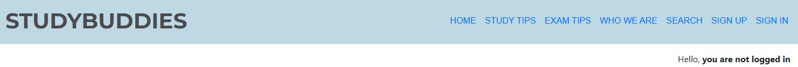

If the User is logged in, then in addition to the pages 1-5 from above, we have the following pages.
1. My Posts
2. Create
3. Sign Out


## Pages
Each navigation takes you to the following pages:
1. Home - this page shows all posts regardless of category and is paginated.

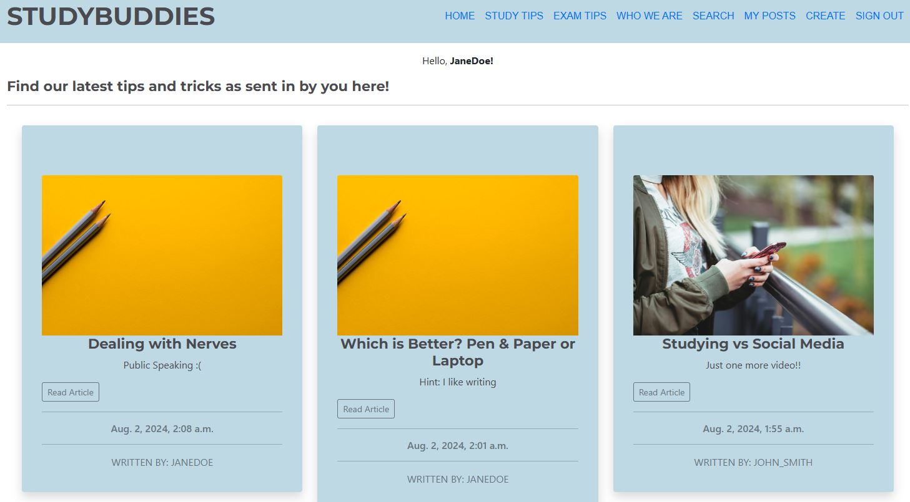

2. Study Tips - page shows all posts of the study tip category and is paginated


3. Exam Tips - page shows all posts of the exam tip category and is paginated


4. Who We Are - page gives a small about section along with when the last post was created

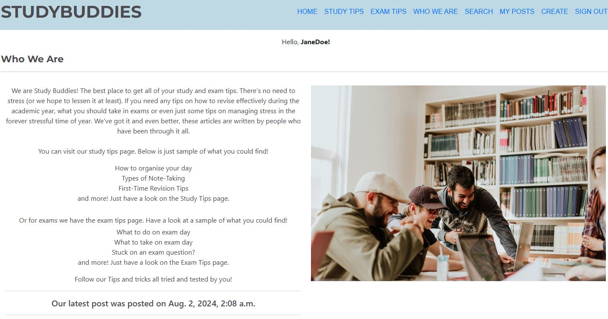

5. Search - user can search for posts and retrieve a list

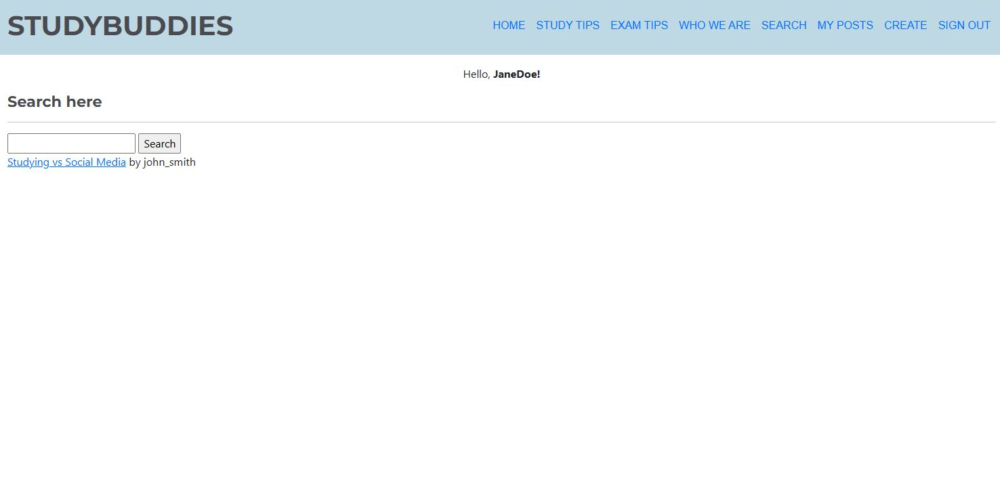

6. Sign Up - a new user can create an account

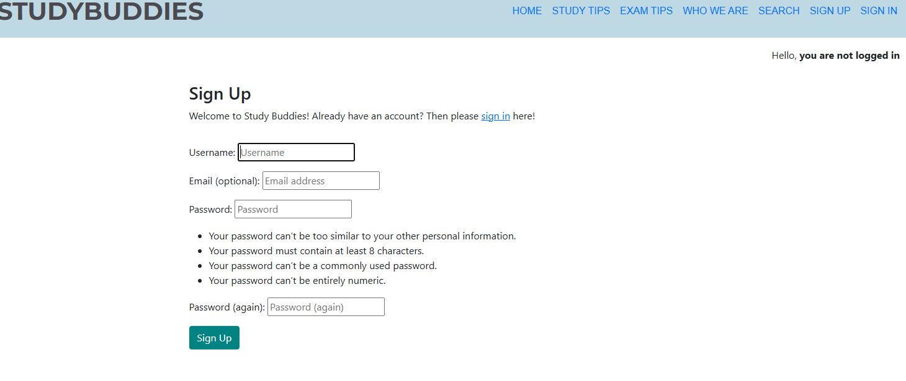

7. Sign In -  a returning user can log in

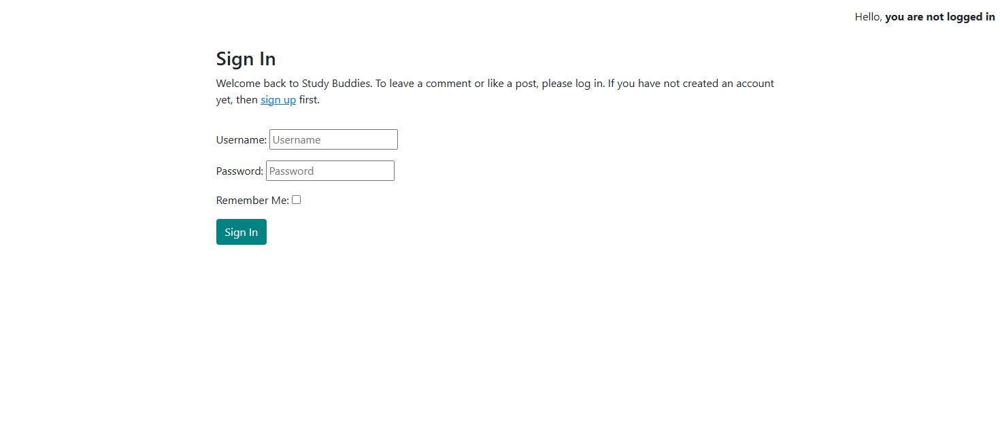

8. My Posts - user can view all published and draft posts

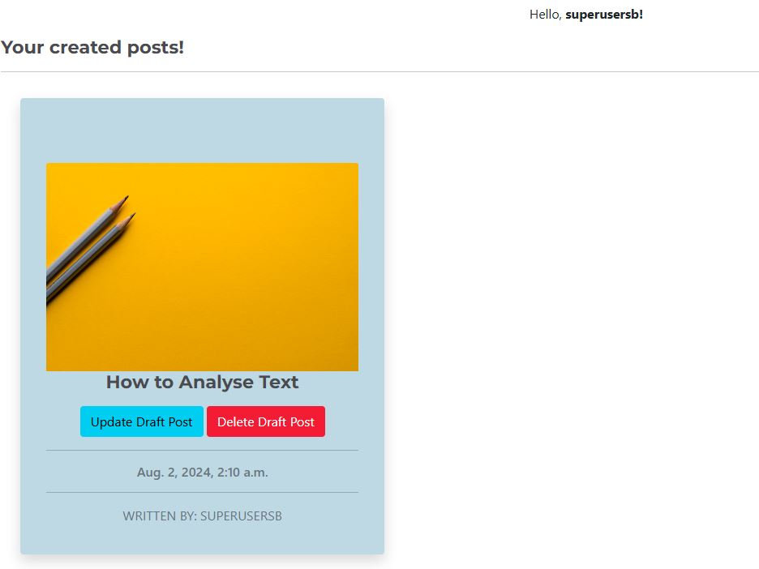
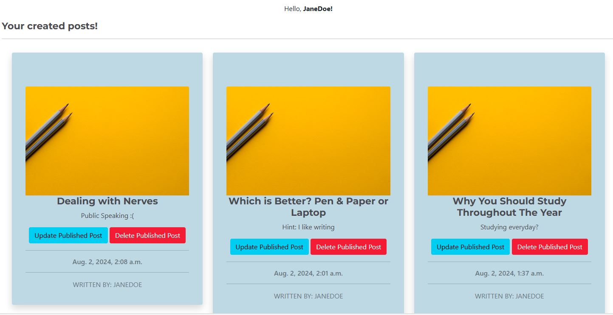

9. Create - given a logged in user, they are able to fill in the form to add a post. 

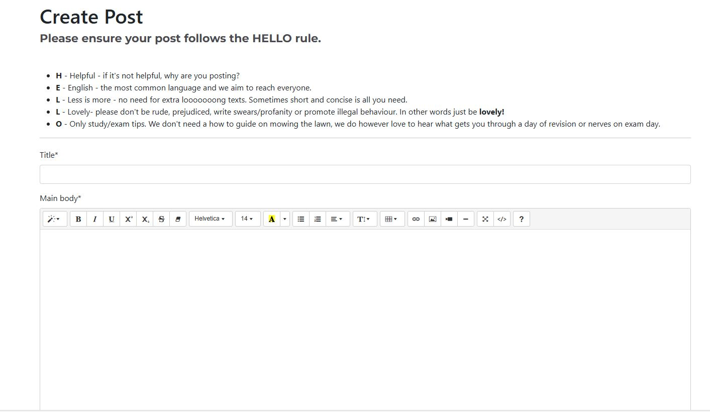
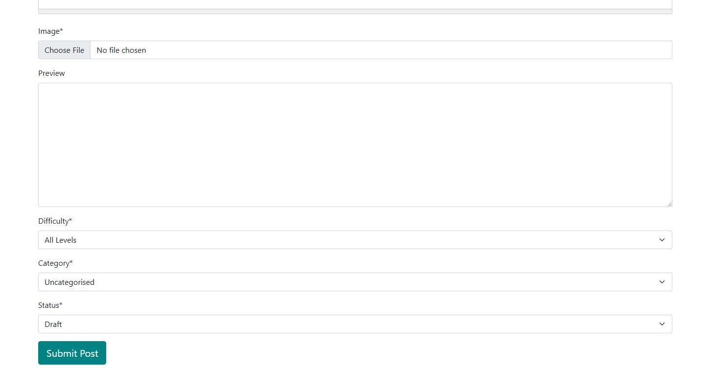

10. Sign Out - when clicking on sign out, user will be asked to confirm they would like to sign out


11. 404 Error - when a user enters the incorrect url, they will get this page


## Footer 
The footer has the icons which take you to the relevant social media pages. 


## Comments
The comments can be written, edited and deleted on each page given a logged in user. Furthermore, a comment count looks at how many comments there are with the blog post. 
When editing the comment, the date and author is written in the box. Should the user wish, they can keep a log of when the edits were made. 

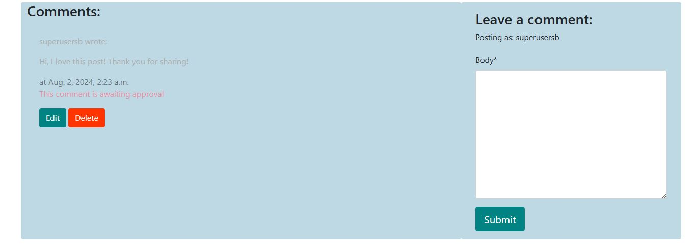
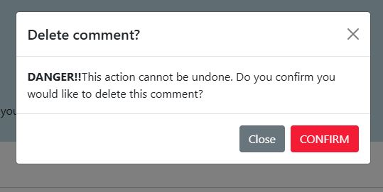
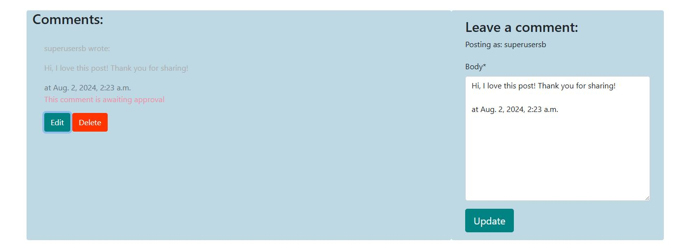
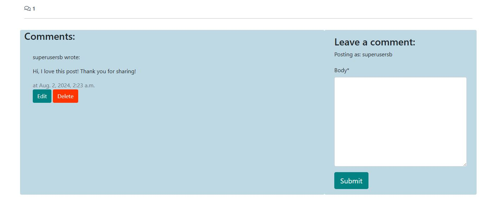


## More Features
Further to the features above, there are some features which would be beneficial to implement. These are listed below:

1. Search bar in nav bar instead of in a new page
  - Search to also reveal a cards of pages instead of a list of pages.
  - Whilst a search in or near the nav bar would be better in this instance, a seperate page would allow for added filters and queries to refine searches which is another feature yet to be implemented.
2. Automated Testing
3. Approval for edited post
  - Currently, as the admin has rights of approving they have already seen and trusted the user, therefore are trusted to edit their page correctly. It would be better and more efficient if the post will be sent for approval.

# **Technologies Used** 
The following technologies - including programming languages, frameworks and sites for testing - are as follows:

- Python
- HTML
- CSS
- JavaScript
- Django
- Bootstrap5
- Microsoft Paint
- Cloudinary
- HTML Validator https://validator.w3.org/
- CSS Validator

exam - https://unsplash.com/photos/mathematics-computation-05A-kdOH6Hw
uncat - https://unsplash.com/photos/woman-holding-red-phone-m7zKB91brGo


Welcome fatimamahate,

This is the Code Institute student template for Gitpod. We have preinstalled all of the tools you need to get started. It's perfectly ok to use this template as the basis for your project submissions.

You can safely delete this README.md file or change it for your own project. Please do read it at least once, though! It contains some important information about Gitpod and the extensions we use. Some of this information has been updated since the video content was created. The last update to this file was: **June 18, 2024**

## Gitpod Reminders

To run a frontend (HTML, CSS, Javascript only) application in Gitpod, in the terminal, type:

`python3 -m http.server`

A blue button should appear to click: _Make Public_,

Another blue button should appear to click: _Open Browser_.

To run a backend Python file, type `python3 app.py` if your Python file is named `app.py`, of course.

A blue button should appear to click: _Make Public_,

Another blue button should appear to click: _Open Browser_.

By Default, Gitpod gives you superuser security privileges. Therefore, you do not need to use the `sudo` (superuser do) command in the bash terminal in any of the lessons.

To log into the Heroku toolbelt CLI:

1. Log in to your Heroku account and go to *Account Settings* in the menu under your avatar.
2. Scroll down to the *API Key* and click *Reveal*
3. Copy the key
4. In Gitpod, from the terminal, run `heroku_config`
5. Paste in your API key when asked

You can now use the `heroku` CLI program - try running `heroku apps` to confirm it works. This API key is unique and private to you, so do not share it. If you accidentally make it public, you can create a new one with _Regenerate API Key_.

### Connecting your Mongo database

- **Connect to Mongo CLI on a IDE**
- navigate to your MongoDB Clusters Sandbox
- click **"Connect"** button
- select **"Connect with the MongoDB shell"**
- select **"I have the mongo shell installed"**
- choose **mongosh (2.0 or later)** for : **"Select your mongo shell version"**
- choose option: **"Run your connection string in your command line"**
- in the terminal, paste the copied code `mongo "mongodb+srv://<CLUSTER-NAME>.mongodb.net/<DBname>" --apiVersion 1 --username <USERNAME>`
  - replace all `<angle-bracket>` keys with your own data
- enter password _(will not echo **\*\*\*\*** on screen)_

------

## Release History

We continually tweak and adjust this template to help give you the best experience. Here is the version history:

**June 18, 2024,** Add Mongo back into template

**June 14, 2024,** Temporarily remove Mongo until the key issue is resolved

**May 28 2024:** Fix Mongo and Links installs

**April 26 2024:** Update node version to 16

**September 20 2023:** Update Python version to 3.9.17.

**September 1 2021:** Remove `PGHOSTADDR` environment variable.

**July 19 2021:** Remove `font_fix` script now that the terminal font issue is fixed.

**July 2 2021:** Remove extensions that are not available in Open VSX.

**June 30 2021:** Combined the P4 and P5 templates into one file, added the uptime script. See the FAQ at the end of this file.

**June 10 2021:** Added: `font_fix` script and alias to fix the Terminal font issue

**May 10 2021:** Added `heroku_config` script to allow Heroku API key to be stored as an environment variable.

**April 7 2021:** Upgraded the template for VS Code instead of Theia.

**October 21 2020:** Versions of the HTMLHint, Prettier, Bootstrap4 CDN and Auto Close extensions updated. The Python extension needs to stay the same version for now.

**October 08 2020:** Additional large Gitpod files (`core.mongo*` and `core.python*`) are now hidden in the Explorer, and have been added to the `.gitignore` by default.

**September 22 2020:** Gitpod occasionally creates large `core.Microsoft` files. These are now hidden in the Explorer. A `.gitignore` file has been created to make sure these files will not be committed, along with other common files.

**April 16 2020:** The template now automatically installs MySQL instead of relying on the Gitpod MySQL image. The message about a Python linter not being installed has been dealt with, and the set-up files are now hidden in the Gitpod file explorer.

**April 13 2020:** Added the _Prettier_ code beautifier extension instead of the code formatter built-in to Gitpod.

**February 2020:** The initialisation files now _do not_ auto-delete. They will remain in your project. You can safely ignore them. They just make sure that your workspace is configured correctly each time you open it. It will also prevent the Gitpod configuration popup from appearing.

**December 2019:** Added Eventyret's Bootstrap 4 extension. Type `!bscdn` in a HTML file to add the Bootstrap boilerplate. Check out the <a href="https://github.com/Eventyret/vscode-bcdn" target="_blank">README.md file at the official repo</a> for more options.

------

## FAQ about the uptime script

**Why have you added this script?**

It will help us to calculate how many running workspaces there are at any one time, which greatly helps us with cost and capacity planning. It will help us decide on the future direction of our cloud-based IDE strategy.

**How will this affect me?**

For everyday usage of Gitpod, it doesn’t have any effect at all. The script only captures the following data:

- An ID that is randomly generated each time the workspace is started.
- The current date and time
- The workspace status of “started” or “running”, which is sent every 5 minutes.

It is not possible for us or anyone else to trace the random ID back to an individual, and no personal data is being captured. It will not slow down the workspace or affect your work.

**So….?**

We want to tell you this so that we are being completely transparent about the data we collect and what we do with it.

**Can I opt out?**

Yes, you can. Since no personally identifiable information is being captured, we'd appreciate it if you let the script run; however if you are unhappy with the idea, simply run the following commands from the terminal window after creating the workspace, and this will remove the uptime script:

```
pkill uptime.sh
rm .vscode/uptime.sh
```

**Anything more?**

Yes! We'd strongly encourage you to look at the source code of the `uptime.sh` file so that you know what it's doing. As future software developers, it will be great practice to see how these shell scripts work.

---

Happy coding!
