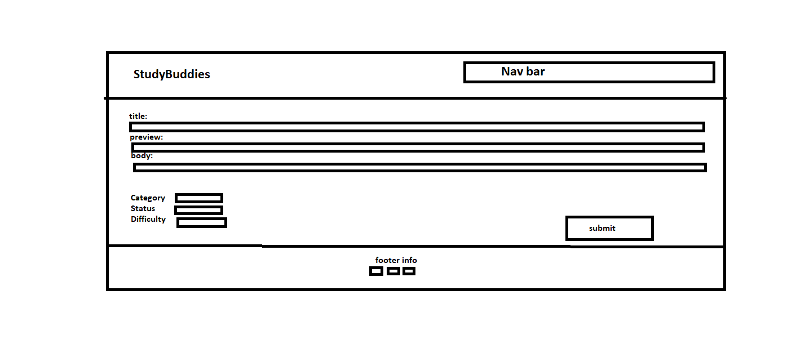
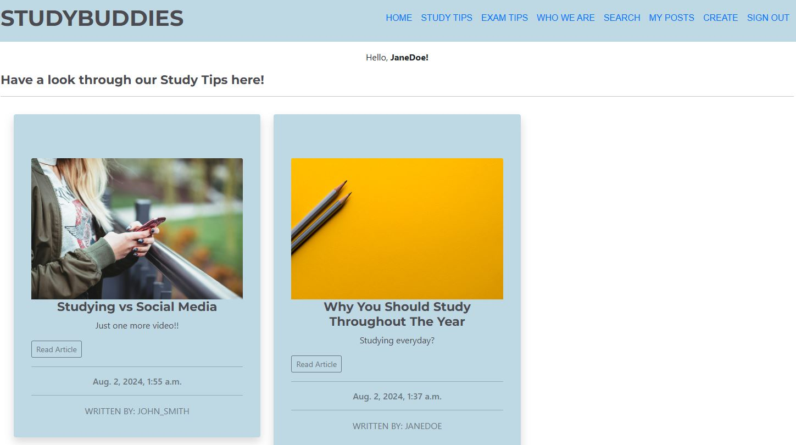
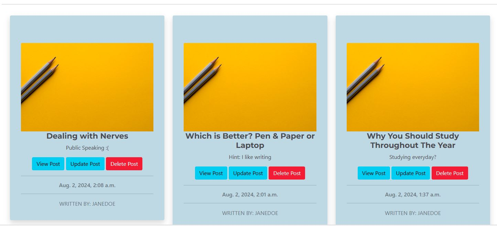

# Study Buddies 
Welcome to the Study Buddies Project. 

Study Buddies is a website dedicated to sharing study and exam tips to all who need it. Exam season can be stressful and knowing where to begin studying can be intimidating, therefore this site lets people (who've been through it all) to share any tips and tricks they want to. A source of inspiration for this site was Wikipedia. On Wikipedia people can share anything they'd like (as long as it follows the rules) regarding any topic. Whilst Wikipedia encompasses all topics related to absolutely anything in the world, Study Buddies focus on specifically studying, whether it's studying just for revision or studying for the all dreaded exam. Similar to Wikipedia, logged in users can share their own posts which ensures we have the latest tips and tricks and we can be sure they work! Even more importantly, it's crucial to be aware that everybody has different ways of working and studying. Because Study Buddies consists of posts written by users, we can be sure there is a plethora of information suitable for every need. 

You can view the deployed site [here](https://studybuddies-pp4-87eb5b7c6767.herokuapp.com/)

# Contents
* [**Project**](<#project>)
    * [Users Goal](<#users-goal>)
    * [Owners Goal](<#owners-goal>)
    * [Agile](<#agile>)
* [**User Experience**](<#user-experience>)
    * [Wireframes](<#wireframes>)
    * [User Stories](<#user-stories>)
* [**Features**](<#features>)
    * [Header](<#header>)
    * [Navigation](<#navigation>)
    * [Pages](<#pages>)
    * [Footer](<#footer>)
    * [More Features](<#more_features>)
* [**Technologies Used**](<#technologies_used>)
* [**Tests**](<#tests>)
* [**Deployment**](<#deployment>)
* [**Credits**](<#credits>)
* [**Code**](<#code>)
* [**Acknowledgements**](<#acknowledgements>)

# **Project**
## Users Goal
The user is somebody who would like to find out more information about the best ways to study both in regular day to day studying and for exams

## Owners Goal
The owner would like the community to be able to share tips and tricks to readers of the site to make studying easy

### Agile
A Github board (project) was used for the agile aspect of this project to manage my user stories. 

### Database
The models created for this project are called:
1. Post - which is the database related to the each blog post. 
2. Comment - which is the database related to the comments on each blog post. 

The following Entity Relationship Diagrams (ERD) using Microsoft Word Online were created for this project. 

# **User Experience**
## Wireframes
The following wireframes were created to design the layout of the pages. It was created using Microsoft Paint.

## User Stories
The User Stories can be split into two perspectives. 
1. Site User 
2. Site Admin

To view the User Stories for this project, you can visit my GitHub board [here.](https://github.com/users/fatimamahate/projects/15)

# **Features**
## Header
The header of the page includes the name of the site which is Study Buddies. The sites name is linked to the homepage so that when users would like to go back, they simply need to click on the site name. Furthermore, the colour chosen is #4A4A4F which is dark grey. This is because it is softer than the harsh black against the background which is rgb(196, 215, 228). See image in Navigation section.

## Navigation
The navigation (nav bar) has the following pages. 
1. Home
2. Study Tips
3. Exam Tips
4. Who We Are
5. Search
6. Sign Up
7. Sign In

If the User is logged in, then in addition to the pages 1-5 from above, we have the following pages.
1. My Posts
2. Create
3. Sign Out

## Pages
Each navigation takes you to the following pages:
1. Home - this page shows all posts regardless of category and is paginated.

2. Study Tips - page shows all posts of the study tip category and is paginated

3. Exam Tips - page shows all posts of the exam tip category and is paginated

4. Who We Are - page gives a small about section along with when the last post was created

5. Search - user can search for posts and retrieve a list

6. Sign Up - a new user can create an account

7. Sign In -  a returning user can log in. Onc logged in the user can see a message to say it is successful

8. My Posts - user can view all published and draft posts

9. Create - given a logged in user, they are able to fill in the form to add a post. 

10. Sign Out - when clicking on sign out, user will be asked to confirm they would like to sign out

11. 404 Error - when a user enters the incorrect url, they will get this page

12. Post submitted, deleted and updated pages - a message is seen depending on what function has occurred. 

## Footer 
The footer has the icons which take you to the relevant social media pages. 

## Comments
The comments can be written, edited and deleted on each page given a logged in user. Furthermore, a comment count looks at how many comments there are with the blog post. 
When editing the comment, the date and author is written in the box. Should the user wish, they can keep a log of when the edits were made. 

## More Features
Further to the features above, there are some features which would be beneficial to implement. These are listed below:

1. Search bar in nav bar instead of in a new page
  - Search to also reveal a cards of pages instead of a list of pages.
  - Whilst a search in or near the nav bar would be better in this instance, a seperate page would allow for added filters and queries to refine searches which is another feature yet to be implemented.
2. Automated Testing
3. Approval for edited post
  - Currently, as the admin has rights of approving they have already seen and trusted the user, therefore are trusted to edit their page correctly. It would be better and more efficient if the post will be sent for approval.

# **Technologies Used** 
The following technologies - including programming languages, frameworks and sites for testing - are as follows:

- Python
- HTML
- CSS
- JavaScript
- Django
- Bootstrap5
- Microsoft Paint
- Cloudinary
- HTML Validator https://validator.w3.org/
- CSS Validator

# **Tests**
Acceptance criteria of each user story is met for test to pass.
|  <u>User Stories</u> |<u>Test</u>   |
|---|---|
|  As a site user I can view all study/exam tip posts so that I can select a post to read. |  Passed  |
|  As a site user I can view a list of study tip posts so that I can select a study tip post to read. | Passed  |
|  As a site user I can view a list of exam tips posts so that I can select an exam tip post to read. | Passed  |
|  As a site user/admin I can create a draft post so that I can save my work and come back to it.  |  Passed |
| As a site user I can sign up to an account so that create, read, update and delete my posts. I can also make comments so that I am involved in the conversation.  | Passed   |
| As a site user/admin I can edit and delete my posts so that I can modify/ remove the posts I am not entirely happy with.  | Passed  |
| As a site user I can view an about page so that I can find out who started this page and what it is about. |  Passed |
| As a site user I can delete a comment so that I can delete a comment if I am not happy with it. | Passed   |
| As a site user I can view all comments on a post so that I can read the conversation users are having.  | Passed  |
| As a site user/admin I can view my posts so that so that I can find a specific post easily.  | Passed  |
| As a site user I can edit my comment so that I can fix any typos or add extra clarification on my comment.  | Passed   |
| As a site admin I can approve/disapprove comments so that I can remove any rude or illegal comments.  | Passed  |
| As a site user I can click on the social media links in the footer so that I can follow Study Buddies on social media.  | Passed  |
| As a site user/admin I can create a post so that I can share my exam/study tips.  |  Passed |
| As a site user I can comment on posts so that I can be involved in the conversation. | Passed  |
| As a site user I can search for a post so that I don't have to look through all posts.  | Passed  |
| As a site admin I can have access to an admin area so that I can view the users and posts and comments  |  Passed |

# **Deployment**
Heroku was used to deploy the live project. The following steps were used to set up Heroku app. 
1. Log in to Heroku website (you may need 2 factor authentication)
2. Click on new and then create new app.
3. Type in a unique app name
4. Select the region closest to you
5. Click on create app.
6. Make sure to open the app you have just created on heroku.
7. Check your version of python and check the heroku stack is compatible
8. In the settings tab, add your config_vars (such as your databases)
9. Navigate to the deploy tab and next to deployment method, choose to connect to your github repo
10. Once connected, as long as your settings.py has DEBUG=False, you can make a manual deployment.
11. Your site is now live. 

# **Credit**
Images were all take from [Unsplash](https://unsplash.com/) and they were free to use. 

There were two default images although one was only used once for the who we are page. 

- Who We Are Page - Photo by: [Priscilla Du Preez](https://unsplash.com/photos/three-men-laughing-while-looking-in-the-laptop-inside-room-XkKCui44iM0)

- Default image as placeholder - Photo by:[Joanna Kosinska](https://unsplash.com/photos/two-gray-pencils-on-yellow-surface-1_CMoFsPfso)

- 'Tackling Your Maths Exam' Post - Photo by: [Antoine Dautry](https://unsplash.com/photos/mathematics-computation-05A-kdOH6Hw)

- 'Studying vs Social Media' Post - Photo by: [freestocks](https://unsplash.com/photos/woman-holding-red-phone-m7zKB91brGo)

# **Code**
1. [Stack Overflow](https://stackoverflow.com/questions/61657061/how-do-i-resize-the-width-of-summernote) - to resize the summernote
2. [Learn Django](https://learndjango.com/tutorials/customizing-django-404-and-500-error-pages) - to include a custom 404 error page
3. [PyTutorial](https://pytutorial.com/django-search-function/) - to include the search function
4. [Code Institute I Think Therefore I Blog Walkthrough (Current and Deprecated)](https://codeinstitute.net/) - a guide to follow for my own blog

# ** Acknowledgements**
This project would not have been completed without my mentor, Precious Ijege's support and advice. Also tutor support for their help on issues I had. 
